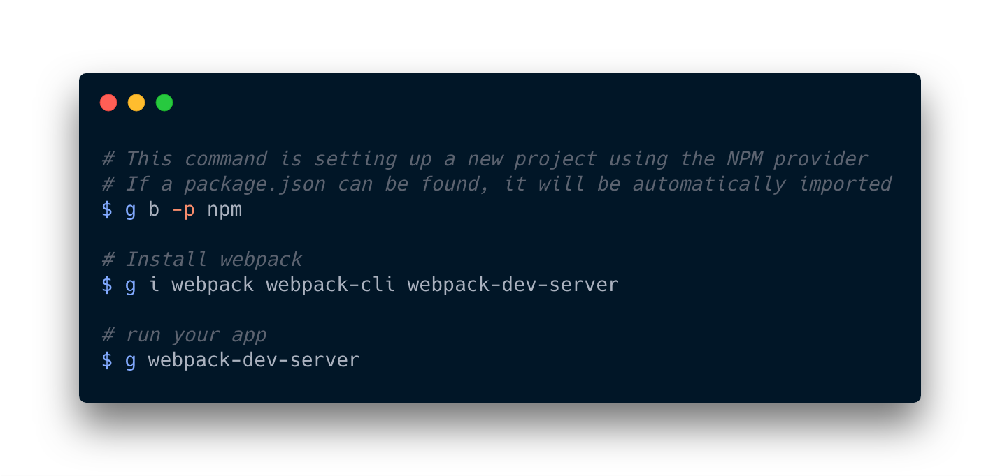
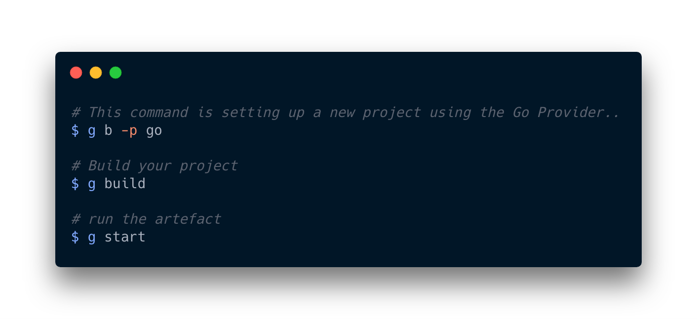

---

<br />
<p align="center">


<br/>


</p>
<br />
<br />
Global Universal Project Manager -- Package manager, CLI tool, and scripts for all your projects and your system. Whether you are a developer managing dependencies, or a sysadmin looking for your new toolbelt (bye bash!) you are among friends. <a href="https://github.com/azukaar/GuPM/wiki">Check the Wiki for documentation.</a> <br />
<br />

 * ⏱ **Fast**. Written in native code, with real multi-threading.
 * 👓 **Smart**. Memory efficient solution using hard-link, which do not duplicate dependencies across project.
 * 🌍 **Global**. Windows, Mac and Linux compatibility.
 * 🌈 **Universal**. Usable in any kind of project (Ruby, JS, Go, C, Python, etc...)
 * 👗 **Customizable**. Flexible plugin system: make GuPM your own.
 * 👝 **Future Proof**. Let's make this the last PM you will ever need.
 * 🌳 **Decentralized**. You keep control of the sources you tap into.
 * 🐳 **No dependencies**. You don't need anythind else (you don't need NPM to use NPM's repository with GuPM)

This idea is born from the frustration of having to give up my habits whenever I would switch off Javascript and lose NPM (Whether it would be in Ruby, Go, or even situations outside of coding). GuPM is claiming to take inspiration from the best things in Brew, NPM, Gem, etc... And compile them in a single tool, usable in any project.
<br />

 * 📦 **Packages Manager**. Install packages from any repository and manage dependencies in a seamless way.
 * 🖥 **CLI Manager**. Install and use CLI tools in a flexible way without conflicts.
 * 🚏 **Scripting**. GuPM is bundled with GuScript, allowing you to build cross platform scripts for your project.
 * 🐙 **Packed with features**. Manage configs, git hooks, parallel executions, environment variables, CI, and more.
 * 🔥 **Even more to come!** See : [Next](https://github.com/azukaar/GuPM/projects/1#column-5571474) for the roadmap of feature. You are welcomed to contribute!
<br />

---

# Getting started : 

## Quick links

 * [Wiki](https://github.com/azukaar/GuPM/wiki)
 * [Quick Start](https://github.com/azukaar/GuPM/wiki/quick-start)
 * [Getting started with Node](https://medium.com/@azukaar/gupm-to-manage-your-node-js-project-b7664503f3de?sk=f901b86d888b44dcdb78c644bd5df002)
 * [Getting started with Go](https://medium.com/@azukaar/gupm-to-manage-your-go-project-5d19c341403c)
 * [Create your own repository](https://github.com/azukaar/GuPM/wiki/repositories)
 * [Official GuPM repository](https://github.com/azukaar/GuPM-official)

## Installation

### Linux and Mac OS : 

⌨️ `$ curl -fsSL  https://azukaar.github.io/GuPM/install.sh | bash`

### Windows 

💾 [Windows_install.exe](https://azukaar.github.io/GuPM/windows_install.exe)

## JS/NPM example

This example is setting up a project using the [NPM plugin](https://github.com/azukaar/GuPM-official).
More details on how to use GuPM with node [here]().

<p align="center">

</p>

## Go example

This example is setting up a project using the [Go plugin](https://github.com/azukaar/GuPM-official).
More details on how to use GuPM with Go [here]().

<p align="center">

</p>

# Dependency Manager

## New projects

In order to simply bootstrap a new project you can run `g bootstrap` you can also use `b` and add a provider `g b -p npm`

## Make

This command will set up your project by getting dependencies. Adding a -p or --provider argument allows you to specify what provider to use initially.
Please note you do NOT need to install npm / gem / whatever to use their corresponding provider, GuPM implement everything itself.

```bash
# reads gupm.json
g make

# reads package.json
g make -p npm
```

## Install

```bash
# use default repo [Config in gupm.json]

g install mysql
g i mysql

# use brew

g install brew://mysql
g install -p brew mysql

# use NPM

g install npm://react@1 # will save in gupm.json
g install -p npm react@1 # will save in package.json
```

More commands [in the wiki](https://github.com/azukaar/GuPM/wiki/cli-references)

## GuPM management

### Plugins

GuPM needs plugins to work with various repos :

```bash
# Install provider-go from the official repo
g plugin install https://azukaar.github.io/GuPM-official/repo:provider-go
```

See https://github.com/azukaar/gupm-official for a list of officially suported plugins.
See https://github.com/azukaar/GuPM/wiki/how-to-create-a-provider to create your own.

### updates

GuPM can be managed using :

```bash
g self upgrade
```

More commands [in the wiki](https://github.com/azukaar/GuPM/wiki/cli-references)

## Write GuPM scripts

You can use GuScript to write bash-like files, used for setting up your project, use it, or anything literally.
Think of GuScript as a replacement for your bash scripts.

```
// name_setup.gs

var name = input('What is your name')
echo('Welcome' + name)
saveName(name)
```

GuScript is based on javascript, and therefore allow advanced object/arrays manipulations, function definitions, etc...
Find more details about the available APIs in the [wiki](https://github.com/azukaar/GuPM/wiki) 1

## VS Code 

Add this to your `settings.json` to treat .gs file as javascript (temporary fix to plain text)

```
"files.associations": {
    "*.gs": "javascript"
}
```

# Thanks!
Package Icon made by [smashicons](https://www.smashicons.com/)
Dog Icon made by [Freepik](https://www.freepik.com/)
